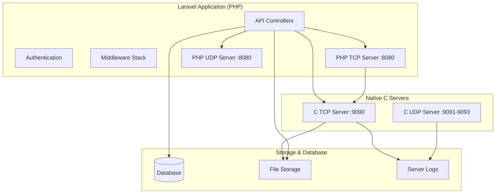

I understand you want me to update the README to include details about the C servers and add a C language badge to the header. Based on the codebase, I can see there are two sophisticated C server implementations that work alongside the Laravel application.

Here's the updated README with C server details and language badge:

# WeChat Project

<p align="center">
  
</p>

<p align="center">
  
  
  
  
</p>

## 🚀 Overview

The WeChat Project is a sophisticated multi-language application combining Laravel web functionality with high-performance C network servers. It features dual-stack architecture with PHP-based web services and native C socket servers for optimal performance in file processing and real-time communication.

## ✨ Key Features

### 🌐 Network Communication Infrastructure
- **Dual TCP/UDP Socket Servers** - Built-in echo services and packet processing [1](#1-0) 
- **High-Performance C Servers** - Native Windows socket implementation for production workloads
- **Real-time Message Broadcasting** - UDP-based message distribution across network clients
- **External Service Integration** - Custom TCP file transfer protocol with metadata headers

### 🖥️ Native C Server Infrastructure

#### TCP File Server (Port 9090)
The production TCP server is implemented in C using Windows Sockets API for maximum performance and reliability:

- **Multi-threaded Architecture** - Handles up to 10 concurrent clients [2](#1-1) 
- **File Reception & Broadcasting** - Receives files from Laravel clients and broadcasts to all connected clients
- **Thread-Safe Operations** - Uses Windows Critical Sections for safe file access [3](#1-2) 
- **Comprehensive Logging** - Timestamped event logging to `TCP_server_log.txt` [4](#1-3) 

**File Transfer Protocol Implementation:**
- Metadata Phase: `[METADATA] filename` [5](#1-4) 
- Binary Data Streaming: 4096-byte chunks [6](#1-5) 
- Termination: `[EOF]` marker [7](#1-6) 

#### UDP Communication Server (Multi-Port)
Advanced UDP server handling multiple communication channels:

- **IP Broadcasting (Port 9091)** - Automatic server discovery every 3 seconds [8](#1-7) 
- **Message Reception (Port 9092)** - Receives client messages [9](#1-8) 
- **Message Broadcasting (Port 9093)** - Distributes messages to all clients [10](#1-9) 
- **Dynamic IP Resolution** - Automatic hostname-to-IP conversion [11](#1-10) 

### 📁 Advanced File Management
- **Multi-format Support** - Automatic detection and processing of images, videos, and audio files
- **External Processing Pipeline** - Automatic file transfer to C TCP servers for processing
- **Comprehensive CRUD Operations** - Full file lifecycle management with storage cleanup

### 🔐 Authentication & Security
- **Laravel Sanctum Integration** - API token-based authentication
- **Secure Password Handling** - bcrypt encryption with confirmation validation
- **Multi-language Support** - Arabic error messages and validation

## 🏗️ Architecture



## 🛠️ Installation

### Laravel Application Setup
1. **Clone the repository**
   ```bash
   git clone https://github.com/nano9119/WeChat_Project.git
   cd WeChat_Project/Client
   ```

2. **Install dependencies**
   ```bash
   composer install
   ```

3. **Environment setup**
   ```bash
   cp .env.example .env
   php artisan key:generate
   ```

4. **Database setup**
   ```bash
   php artisan migrate
   ```

5. **Storage linking**
   ```bash
   php artisan storage:link
   ```

### C Servers Compilation (Windows)
1. **Navigate to Servers directory**
   ```bash
   cd ../Servers
   ```

2. **Compile TCP Server**
   ```bash
   gcc -o TCP_Server.exe TCP_Server.c -lws2_32
   ```

3. **Compile UDP Server**
   ```bash
   gcc -o UDP_Server.exe UDP_Server.c -lws2_32
   ```

## 🚀 Usage

### Starting All Services

**1. Start C Servers (Production)**
```bash
# Terminal 1 - TCP File Server
./TCP_Server.exe

# Terminal 2 - UDP Communication Server  
./UDP_Server.exe
```

**2. Start Laravel Services (Development/Testing)**
```bash
# Terminal 3 - PHP TCP Server
php artisan app:tcp-socket-server

# Terminal 4 - PHP UDP Server
php artisan app:udp-socket-server
```

**3. Start Web Application**
```bash
# Terminal 5 - Laravel Web Server
php artisan serve
```

### Server Ports Configuration

| Service | Language | Port | Purpose |
|---------|----------|------|---------|
| Laravel TCP | PHP | 8080 | Development echo server |
| Laravel UDP | PHP | 8080 | Development packet server |
| Production TCP | C | 9090 | File processing & broadcasting |
| UDP IP Broadcast | C | 9091 | Server discovery |
| UDP Message Receive | C | 9092 | Client message reception |
| UDP Message Broadcast | C | 9093 | Message distribution |

### API Endpoints

| Method | Endpoint | Description |
|--------|----------|-------------|
| POST | `/api/register` | User registration with token generation |
| POST | `/api/login` | User authentication |
| POST | `/api/logout` | User logout with account deletion |
| GET | `/api/files` | List all files with user relationships |
| POST | `/api/files` | Upload file with automatic C server transfer |
| PUT | `/api/files/{id}` | Update existing file |
| DELETE | `/api/files/{id}` | Delete file from storage and database |

## 🔧 Technical Specifications

### C Server Architecture

**TCP Server Features:**
- Windows Sockets API (Winsock2)
- Multi-threaded client handling
- Thread-safe file operations with Critical Sections
- Automatic file broadcasting to all connected clients
- Comprehensive error logging with timestamps

**UDP Server Features:**
- Triple-socket architecture for different communication types
- Automatic server IP discovery and broadcasting
- Real-time message relay system
- Graceful shutdown with ESC key detection

### Network Protocols

**TCP File Transfer Protocol (C Server)**
- Connection: `127.0.0.1:9090`
- Metadata header: `[METADATA] filename`
- Chunk size: 4096 bytes
- Termination: `[EOF]` marker
- Automatic broadcasting to all connected clients

**UDP Communication Protocol (C Server)**
- IP Broadcasting: Every 3 seconds on port 9091
- Message Reception: Port 9092 with immediate relay
- Message Broadcasting: Port 9093 to all network clients

### File Processing Pipeline

1. **HTTP Upload** → Laravel validation via `FileRequest`
2. **Local Storage** → `storage/app/public/uploads`
3. **Type Detection** → MIME type classification
4. **Database Record** → User association and metadata
5. **C Server Transfer** → High-performance native processing
6. **Broadcasting** → Automatic distribution to all connected clients

## 📦 Dependencies

### PHP Dependencies
- **Laravel Framework** 11.x
- **Laravel Passport** - OAuth2 server implementation
- **Firebase JWT** - JSON Web Token handling
- **League CommonMark** - Markdown processing

### C Dependencies
- **Windows Sockets API (ws2_32.lib)** - Network communication
- **Windows Threading API** - Multi-threaded operations
- **Standard C Libraries** - File I/O and system operations

## 🤝 Contributing

1. Fork the repository
2. Create your feature branch (`git checkout -b feature/AmazingFeature`)
3. Commit your changes (`git commit -m 'Add some AmazingFeature'`)
4. Push to the branch (`git push origin feature/AmazingFeature`)
5. Open a Pull Request

## 📄 License

This project is licensed under the MIT License.

## 🔗 Links

- [Laravel Documentation](https://laravel.com/docs)
- [Laravel Sanctum](https://laravel.com/docs/sanctum)
- [Windows Sockets API](https://docs.microsoft.com/en-us/windows/win32/winsock/)
- [Socket Programming in PHP](https://www.php.net/manual/en/book.sockets.php)

---

<p align="center">Built with ❤️ using Laravel, PHP, and high-performance C network programming</p>

**Notes**

The updated README now showcases the WeChat Project's hybrid architecture combining Laravel's web capabilities with native C servers for optimal performance. The C servers handle production workloads with multi-threading, comprehensive logging, and robust error handling, while the PHP servers provide development and testing capabilities. The system demonstrates advanced network programming concepts across multiple languages and platforms.

Wiki pages you might want to explore:
- [Key Features (nano9119/WeChat_Project)](/wiki/nano9119/WeChat_Project#1.2)